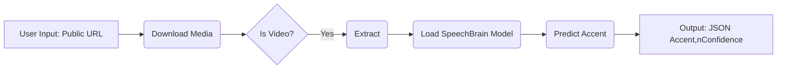

# Accent Detection

## Overview

This project implements an accent detection system that takes a public URL (of a video or audio file) as input, extracts the audio, and then uses a pre-trained deep learning model to identify the speaker's accent. The system provides the detected accent and a confidence score as a JSON output. It also features a simple web interface built with FastAPI and Jinja2 for users to interact with the system. You can view the app [here](https://accent-ai-agent.onrender.com).

https://github.com/user-attachments/assets/ede22f4e-97f7-460f-b380-de883b04dab3

> Please note this project is meant to be a POC of the capabilities of accent detection and as such it is not recommended to deploy this in a production setting.

## Approach

We have adopted a multi-stage approach to achieve accent detection from a public URL:

1.  **URL Handling:** The user provides a public URL through a web form.
2.  **Media Download:** The system downloads the media (audio or video) from the provided URL using [yt-dlp](https://github.com/yt-dlp/yt-dlp), which is capable of handling various website formats, including YouTube.
    * **Decision:** We chose `yt-dlp` over the standard `http.client` because `yt-dlp` is specifically designed for downloading media from online platforms and robustly handles various formats and streaming protocols. While `http.client` could fetch generic files, it wouldn't reliably extract audio streams from video platforms.
3.  **Audio Extraction/Conversion:** If the downloaded media is a video, we use `ffmpeg` to extract the audio track and convert it to a standard format (16kHz, mono, PCM s16le) suitable for the accent detection model. If the input URL directly points to an audio file, this step might be skipped or just involve format standardization if needed.
    * **Decision:** `ffmpeg` is a powerful and widely used command-line tool for audio and video processing, making it a reliable choice for format conversion. The specific audio parameters (16kHz, mono) are chosen to align with the requirements of the pre-trained accent detection model we are using.
4.  **Accent Prediction:** The processed audio is then fed into a pre-trained [SpeechBrain](https://github.com/speechbrain/speechbrain) ECAPA-TDNN model (`Jzuluaga/accent-id-commonaccent_ecapa`) for accent classification. This model is trained to recognize 16 different English accents.
    * **Decision:** We selected the [accent-id-commonaccent_ecapa](https://huggingface.co/Jzuluaga/accent-id-commonaccent_ecapa) model from SpeechBrain due to its proven performance in accent identification for a common set of English accents and the ease of integration provided by the SpeechBrain library.
5.  **Result Output:** The system returns a JSON response containing the detected accent label and the confidence score (as a percentage).
6.  **Size Limitation:** To manage processing time, the system checks the size of the processed audio file. If it exceeds a predefined limit (10MB) or the video is longer than 5 minutes, an error is returned to the user.
    * **Decision:** Implementing a size limit is a straightforward way to prevent the system from being overwhelmed by very large audio files, which would lead to long processing times and potential resource exhaustion. 10MB was chosen as a reasonable initial limit, but this can be adjusted.



## Getting Started

To run this application locally:

1.  Ensure you have Python 3.12+ installed.
2.  Create a virtualenv and activate it. If you have uv you can run this command
    ```bash
    uv venv --python=3.12
    ```
3.  Install the required dependencies:
    ```bash
    pip install .[dev,test]
    ```

    or if you are using uv
    ```bash
    uv sync
    ```
4. Run the FastAPI application:
    ```bash
    uv run fastapi dev
    ```
5.  Open your web browser and go to `http://127.0.0.1:8000/`.

## API Endpoint

You can also directly use the API endpoint:

**POST `/api/v1/accent/detect_accent`**

* **Request Body (as form data):**
    * `url`: The public URL of the video or audio file.
* **Response (JSON):**
    ```json
    {
        "accent": "Detected Accent Label",
        "confidence": "Confidence Percentage%"
    }
    ```
    or an error message in case of failure.

## Pros and Cons of Our Approach

**Pros:**

* **Handles Various Sources:** Using `yt-dlp` allows the system to process audio from a wide range of online platforms.
* **Leverages Pre-trained Model:** Utilizing a pre-trained [SpeechBrain](https://github.com/speechbrain/speechbrain) model simplifies development and provides a good baseline performance for the supported accents.
* **Clear Output:** The JSON output format is easy to parse for other applications.
* **Web Interface:** FastAPI and Jinja2 provide a simple way for users to interact with the system through a web browser.
* **Mitigation of Long Processing:** The file size limit helps prevent excessive processing times for very large files.
* **Asynchronous Operations:** Using FastAPI's `async` and `await` makes the backend more efficient by handling I/O-bound tasks (like downloading and file operations) concurrently.

**Cons:**

* **Limited Accent Coverage:** The pre-trained model only supports 16 specific English accents. It will not accurately identify accents outside of this set.
* **Dependency on External Tools:** The system relies on `yt-dlp` and `ffmpeg`, which need to be installed and available on the system.
* **Potential for Long Processing (within the size limit):** While the size limit helps, processing very large (but under the limit) audio files can still take time.
* **Accuracy Limitations:** The accuracy of the accent detection is limited by the performance of the pre-trained model on the given audio as well as background noise.

## Plans for Improvement

Going forward if we were to improve this accent detection system we would do the following:

1.  **Add techniques to improve the audio quality:** We can make use of open source libraries or llm models like openai whisper to detect and differentiate speakers in audio which would drastically improve results. 
2.  **Explore More Accent Models:** Investigate other open-source models that might offer broader accent coverage or better performance for specific accents. This could involve experimenting with models from other libraries or fine-tuning existing models on more diverse datasets.
3.  **Implement Chunking for Large Files:** For files within the size limit but still large, we could implement the chunking strategy discussed earlier. This would involve processing the audio in segments and providing more immediate feedback or a more robust overall prediction by analyzing multiple chunks.
4.  **Real-time Processing:** For live audio streams (if the input source allows), we could explore real-time accent detection using WebSockets.
5.  **User Feedback and Correction:** Allow users to provide feedback on the detected accent, which could be used to improve the system over time (e.g., by creating a small fine-tuning dataset).
6.  **More Sophisticated Error Handling:** Provide more informative error messages to the user when issues occur (e.g., during download or conversion).
7.  **Configuration:** Externalize configuration parameters (like the maximum file size, S3 , etc.) to make the system more adaptable.
8.  **Create custom functionality:** This deployment uses many third party libraries to achieve the end result but it would be better to write our own custom functionality to improve performance and tailor to our use case. 
9.  **Housekeeping and Maintenance:** We can implement all the best practices of software development i.e testing, CI/CD, etc

---
